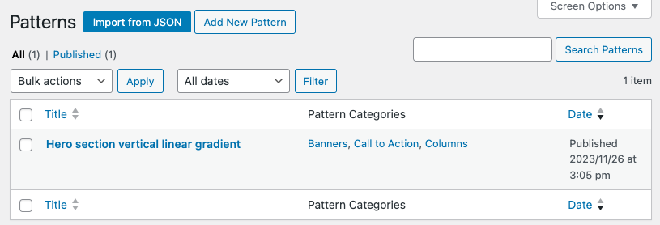

# Ready to use patterns for WordPress

Here you can find some custom patterns you can download in your website.
For easy importing, these are .json files that you can use in *yourwebsite.com/wp-admin/edit.php?post_type=wp_block*
To manage easily your Reusable blocks and Patterns in the dashboard, you can use this plugin [Reusable Blocks Extended](https://wordpress.org/plugins/reusable-blocks-extended/)

## Patterns hosted in WordPress

You can find some of them in [WordPress.org Pattern Directory](https://wordpress.org/patterns/author/vblank/)

These patterns contains default content you can edit, don't forget to replace sample images by your own media 😉

